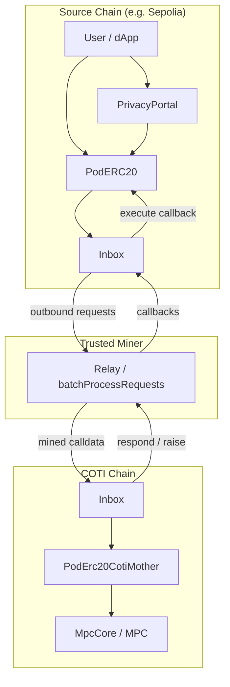

# Security Audit Report: COTI PoD Inbox & Pod Contracts

**Date:** June 30, 2026  
**Scope:** `coti-pod-inbox-contracts` (inbox stack) and `coti-contracts/contracts/pod/**` (PoD apps, pToken, PrivacyPortal, codec). Excludes non-pod dapps in `coti-contracts`.

**Methodology:** Architecture review → function-level analysis → adversarial invariant testing. Code treated as untrusted; comments not relied upon.

---

## Phase 1: Architecture Summary

### Protocol purpose

Cross-chain **message bus** (Inbox) connecting **source chains** (e.g. Sepolia, Fuji) to **COTI** for MPC execution. PoD apps send async two-way messages; a **miner/relayer** ingests outbound requests from chain A and calls `batchProcessRequests` on chain B. Targets execute with a gas budget; callbacks return via one-way messages.

**Privacy stack:** `PrivacyPortal` locks public ERC20 → async `PodERC20` mint on COTI. Withdrawals transfer pTokens to portal → release underlying → burn pTokens on COTI.

### Actors

| Actor | Role |
|--------|------|
| Users / dApps | Pay fees; call `sendTwoWayMessage` / pToken / portal |
| Inbox owner | Miners, oracle, fee config, pause, fee withdrawal |
| Miners | Sole writers of inbound state via `batchProcessRequests` |
| COTI MPC executor / `PodErc20CotiMother` | Authoritative garbled balances |
| Portal factory owner | Deploy portals, global pause, factory allowlist on COTI |
| Price oracle admin | Manual price override |

### Trust boundaries

```
[Source chain]                    [Miner - TRUSTED]              [Target chain]
  User → Inbox.send*  ──events──►  reads requests  ──calldata──►  batchProcessRequests
                                       │                              │
                                       │ (NO on-chain proof)           ▼
                                       └──────────────────────►  target.call()
```

**Critical:** Target chain does **not** verify mined payloads against source-chain `requests` storage. The miner is a **trusted relayer** with ability to forge or alter `methodCall`, `targetFee`, `callerFee`, and addresses.

### Upgradeability

- Inbox: **not upgradeable**; one-shot `init()` for CreateX deterministic deploy.
- Portal / pToken: **minimal clones** + `initializer`; implementation locked via `_disableInitializers()`.

### Asset flows

- Native fees: `msg.value` on send → inbox balance → `collectFees` (owner).
- Portal: underlying ERC20/native in ↔ pToken supply on COTI (1:1 intended).
- pToken: ciphertext cache on PoD; real balances on COTI mother.

### State machines

- Outbound request: created → (optional) executed flag on callback.
- Incoming request: mined → executed (+ error on failure).
- pToken request: `Pending` → `Success` / `Failed`.
- Portal withdrawal: `TransferPending` → `Released`.

### Critical invariants (intended)

1. Miner only relays authentic, ordered messages per `(sourceChainId, nonce)`.
2. `targetFee` / `callerFee` mined on target match what the user paid for on source.
3. Portal underlying balance ≥ net collateral obligations.
4. COTI pToken supply matches portal-locked collateral.
5. Callbacks to pToken only from configured `(cotiChainId, cotiSideContract)`.

---

## Findings

---

### Title: Unauthenticated `Inbox.init()` enables ownership hijack on non-atomic deploy

### Severity

**High**

### Location

`coti-pod-inbox-contracts/contracts/Inbox.sol` — `init()`, lines 20–23

### Description

`init(initialOwner, _chainId)` is `external` with no access control. First caller sets `chainId` and transfers ownership.

### Root Cause

Initialization separated from constructor for CreateX bytecode uniformity; no restriction on `msg.sender`.

### Attack Scenario

1. Deployer deploys `Inbox` without atomic `deployCreate3AndInit`.
2. Attacker front-runs `init(attacker, chainId)`.
3. Attacker becomes owner: adds self as miner, drains fees, pauses processing, sets malicious oracle.

### Impact

Full administrative control of inbox on that chain.

### Likelihood

**Low** in documented CreateX path; **High** on manual or broken deploy scripts.

### Recommendation

Restrict `init` to deployer or factory; or use OpenZeppelin `Initializable` with immutable deployer guard.

### Suggested Code Fix

```solidity
address private immutable _deployer;
constructor() InboxMiner() { _deployer = msg.sender; }
function init(address initialOwner, uint256 _chainId) external {
    require(msg.sender == _deployer, "Inbox: not deployer");
    ...
}
```

---

### Title: Miner can forge or alter cross-chain messages (no source-chain verification)

### Severity

**High** (protocol trust model) / **Critical** if miner key compromised

### Location

`InboxMiner.sol` — `batchProcessRequests()`, lines 28–121

### Description

`MinedRequest` fields (`methodCall`, `targetFee`, `callerFee`, `sourceContract`, etc.) are accepted from the miner. There is no check against `requests[requestId]` on the source chain, no Merkle proof, no signature from source inbox.

### Root Cause

Relayer-centric design; contiguity and ID packing are the only on-chain constraints.

### Attack Scenario

1. Compromised or malicious miner mines inbound message on COTI with:
   - Arbitrary `methodCall` (e.g. `mintPublic` to attacker),
   - `targetFee = 1` (execution OOG),
   - `callerFee = 0` (callback cannot be funded on return leg).
2. Or forge callback to PoD app that only checks `onlyInbox` (e.g. `MpcAdder.receiveC`) with fake MPC result.

### Impact

Forged MPC results, griefed execution, stolen mints (if COTI mother accepts message as from registered pToken), protocol-wide liveness failure.

### Likelihood

**Low** with honest infra; **Critical** if miner key leaked (single key often registered on all chains per deploy scripts).

### Recommendation

Document as explicit trust assumption; use multisig miner; consider light-client or signed message bundles; apps must validate `inboxMsgSender()` like `PodERC20` does.

### Suggested Code Fix

Optional on-chain binding:

```solidity
Request memory src = /* cross-chain light client or stored commitment */;
require(keccak256(abi.encode(minedRequest.methodCall)) == src.methodCallHash, "hash mismatch");
require(minedRequest.targetFee == src.targetFee, "fee mismatch");
```

---

### Title: Mined `callerFee` / `targetFee` not bound to source-chain payment

### Severity

**High**

### Location

`InboxMiner.sol` — `batchProcessRequests()`, lines 78–79, 191–215  
`InboxBase.sol` — `respond()`, lines 146–154

### Description

Fees used for `call{gas: targetFee}` and for callback `callerFee` come from miner-supplied `MinedRequest`, not from the source chain’s stored `Request`. Honest relayer copies them (`relay-helper.ts`), but contracts do not enforce equality.

### Root Cause

No cross-chain fee attestation.

### Attack Scenario

Malicious miner sets `callerFee = 0` when mining a two-way request on COTI. Target executes and calls `respond()`; outbound callback uses `incomingRequest.callerFee == 0`, causing callback execution to OOG or fail minimum fee checks on PoD.

### Impact

Users pay on source chain but never receive callbacks; stuck `Pending` pToken ops; dApp state divergence.

### Likelihood

**Medium** under compromised miner; **Low** with honest relayer.

### Recommendation

Require relayer to pass fees that match a committed hash from source events, or store fee caps in a registry keyed by `requestId`.

---

### Title: Withdrawal releases collateral before guaranteed pToken burn — solvency gap

### Severity

**High**

### Location

`PrivacyPortal.sol` — `_releaseWithdrawal()`, `_trySubmitBurn()`, lines 293–377

### Description

After pToken transfer succeeds, portal **always** releases underlying to `recipient`, then **best-effort** burns via `try pToken.burn`. Burn failure increments `burnDebtAmount` but does not roll back release.

### Root Cause

Intentional liveness-over-atomicity design; burn depends on user-supplied `burnFee` and async COTI path.

### Attack Scenario

1. User (or attacker) requests withdrawal with insufficient `burnFee`.
2. Transfer succeeds; underlying released.
3. `burn` reverts in `try`; pTokens remain on COTI in portal’s balance.
4. **Collateral ↓, pToken supply unchanged** → undercollateralized bridge.

### Impact

Protocol insolvency; remaining depositors cannot redeem full value; owner must fund `burnAccumulatedDebt`.

### Likelihood

**Medium** (misconfigured fees, oracle spikes, COTI congestion).

### Recommendation

Validate `burnFee` against `pToken.estimateFee()` minimum; optionally hold release until burn `Success`; or escrow released funds until burn confirms.

### Suggested Code Fix

```solidity
(uint256 total,,) = pToken.estimateFee();
require(burnFee >= total, "burn fee too low");
// Or: withdrawal.status = BurnPending until burn callback
```

---

### Title: Failed async mint leaves portal collateral with no refund path

### Severity

**High**

### Location

`PrivacyPortal.sol` — `_deposit()`, lines 154–169

### Description

Portal pulls `underlyingToken` from user, then calls `pToken.mint`. If mint fails on COTI (`transferError`), portal has no handler to return underlying.

### Root Cause

No mint-failure callback or portal-side reconciliation.

### Attack Scenario

Mint fails (COTI error, insufficient inbox fee, mother not registered). User’s ERC20 locked in portal permanently unless owner intervenes off-chain.

### Impact

Stuck user funds; reputational and legal risk.

### Likelihood

**Medium** (registration races, fee misconfiguration, paused COTI).

### Recommendation

Track deposit `requestId`; add `refundFailedMint(requestId)` after `RequestStatus.Failed`; or escrow until mint `Success`.

---

### Title: Spot Uniswap V2 oracle manipulable for cross-chain fee conversion

### Severity

**Medium**

### Location

`UniswapPriceOracle.sol` — `_spotPrice()`, lines 69–84  
`InboxFeeManager.sol` — `validateAndPrepareTwoWayFees()`, lines 143–157

### Description

Fee conversion uses cached spot reserves. `fetchPrices()` is called on every send but is interval-gated; `priceAdmin` can set arbitrary prices.

**Production recommendation:** deploy `ChainlinkPriceOracle` (Chainlink Data Feeds for ETH/USD or AVAX/USD; COTI leg manual). Stale feed reads keep the last cache so sends are not blocked. Inbox and Privacy Portal factory can share one oracle address; upgrade via `setPriceOracle` without redeploying the inbox.

### Root Cause

Spot pricing + centralized override without bounds.

### Attack Scenario

1. Flash-loan manipulate local pair before `fetchPrices` interval elapses (or bribe `priceAdmin`).
2. Distort `localPrice` / `remotePrice` ratio so users underpay remote `targetGasRemoteUnits`.
3. Remote executions OOG; users overpay on other direction.

### Impact

Griefed execution, fee extraction asymmetry, owner can extract excess fees via skewed oracle.

### Likelihood

**Medium** on low-liquidity pairs.

### Recommendation

TWAP, Chainlink, or min/max price bounds; separate `priceAdmin` from owner with timelock.

---

### Title: `tx.gasprice` used in fee validation enables underpayment

### Severity

**Medium**

### Location

`InboxFeeManager.sol`, lines 146–149, 174–175

### Description

`callerGasLocalUnits = callbackFeeLocalWei / gasPrice` uses submitting tx’s `tx.gasprice`. On chains with low base fee or `tx.gasprice == 0` (uses `DEFAULT_GAS_PRICE`), users can maximize gas units per wei paid.

### Root Cause

Fee pegged to submitter-controlled gas price, not network minimum or oracle gas price.

### Attack Scenario

User sets very low `maxFeePerGas` on L2; passes min checks while remote gas budget (oracle-converted) is insufficient for real execution.

### Impact

Systematic execution failures; miner must subsidize or users retry.

### Likelihood

**Medium** on L2s with flexible gas pricing.

### Recommendation

Use `block.basefee` floor, configured `minGasPrice`, or fixed gas-unit templates independent of `tx.gasprice`.

---

### Title: PoD callback apps without `inboxMsgSender` check vulnerable to forged callbacks

### Severity

**Medium**

### Location

`MpcAdder.sol` — `receiveC()`, lines 41–43  
`PodLibBase.sol` — `onDefaultMpcError()`, lines 68–71

### Description

`PodERC20` verifies `(remoteChainId, remoteContract) == (cotiChainId, cotiSideContract)`. Example apps only use `onlyInbox`, trusting any mined inbound message.

### Root Cause

Inconsistent callback hardening across app layer.

### Attack Scenario

Malicious miner mines fake successful callback to `MpcAdder.receiveC` with arbitrary ciphertext “result”.

### Impact

False MPC outputs in dependent logic.

### Likelihood

**Low** (requires bad miner); **High** impact for apps copying `MpcAdder` pattern.

### Recommendation

Standard mixin requiring `inbox.inboxMsgSender()` matches configured executor/mother.

---

### Title: `transferAndCall` callback uses unbounded gas to `to.call`

### Severity

**Medium**

### Location

`PodERC20.sol` — `transferCallback()`, line 310

### Description

`(bool success,) = address(to).call(callbackData)` forwards all remaining gas. Malicious `to` can consume gas in callback; failure only emits `RequestCallbackFailed` — transfer not reverted.

### Root Cause

ERC-1363-style pattern without gas stipend.

### Attack Scenario

Portal sets callback to contract with expensive fallback; griefs relayer/miner gas; transfer still final on COTI/PoD.

### Impact

Relayer DoS; integrators may assume atomic transfer+callback.

### Likelihood

**Low–Medium** for malicious integrators.

### Recommendation

Document non-atomic semantics; optional `gas` stipend parameter.

---

### Title: Global per-token nonce on COTI with per-account gating on PoD

### Severity

**Low** (design) / **Informational** for integrators

### Location

`PodErc20CotiMother.sol` — `_tokenNonce`  
`PodERC20.sol` — `balanceNonces`, lines 292–304

### Description

COTI uses one nonce per token namespace; PoD applies updates only if `balanceNonces[account] < nonce`. Out-of-order delivery preserves latest state for sequential ops on same account, but skipped stale updates can leave ciphertext temporarily inconsistent with COTI until next sync.

### Root Cause

Asymmetric nonce models across chains.

### Impact

Stale `balanceOf` reads; integrators must use `syncBalances` or wait for latest nonce.

### Likelihood

**Low** with ordered miner.

### Recommendation

Document; per-account nonces on COTI callbacks, or always accept latest global nonce with full state vector.

---

### Title: `batchProcessRequests` unbounded loop — block gas DoS

### Severity

**Low**

### Location

`InboxMiner.sol`, lines 46–116

### Description

Arbitrary `mined.length` in one tx. Large batches + MPC-heavy targets can exceed block gas.

### Root Cause

No max batch size.

### Impact

Miner self-DoS; chain congestion.

### Likelihood

**Low** (miner controls input).

### Recommendation

`MAX_BATCH_SIZE` constant; document operational limits.

---

### Title: `collectFees` sends entire ETH balance — no reentrancy guard

### Severity

**Low**

### Location

`InboxFeeManager.sol` — `_collectFees()`, lines 53–61

### Description

`onlyOwner` external call with all balance. Malicious `to` could reenter if owner is a contract; second `collectFees` would send 0.

### Root Cause

Missing `nonReentrant` on fee withdrawal.

### Impact

Limited; owner trust assumed.

### Recommendation

Add `nonReentrant` for defense in depth.

---

### Title: Token registration uses `errorSelector = 0` — silent registration failure

### Severity

**Low**

### Location

`PrivacyPortalFactory.sol` — `_requestMotherRegistration()`, lines 202–204

### Description

One-way registration with `bytes4(0)` error handler. Failed COTI registration leaves pToken unregistered with no on-chain error on source.

### Root Cause

No error callback wired.

### Impact

Deposits/mints fail later; poor UX and stuck collateral risk.

### Recommendation

Wire factory error handler; emit failure events; retry mechanism.

---

### Title: Portal `pauseController` defaults to factory, not `portalOwner`

### Severity

**Informational**

### Location

`PrivacyPortal.sol` — `initialize()`, line 132

### Description

`pauseController = msg.sender` (factory). Factory owner can pause all portals; `portalOwner` cannot until `setPauseController`.

### Impact

Centralized pause by factory owner (may be intended).

### Recommendation

Document; or set `pauseController = portalOwner` if decentralization desired.

---

### Title: `raise` and `respond` share `inboxResponses` — cannot both fire

### Severity

**Informational** (correct behavior)

### Location

`InboxBase.sol`, lines 130, 168

### Description

Mutual exclusion prevents double reply. Verified safe.

---

### Title: Clone initialization front-run (mitigated in factory)

### Severity

**Informational**

### Location

`PodErc20MintableInitializable.sol`, `PrivacyPortal.sol`

### Description

Documented risk; `PrivacyPortalFactory.createPortal` initializes atomically. Direct `clone` without init remains exploitable.

---

## Invariant Analysis

| Invariant | Breakable? |
|-----------|------------|
| Inbound nonces contiguous per source | Miner must submit contiguous batch; **enforced** |
| Request ID unique globally | **Enforced** via packing |
| Source fees → target execution gas | **NOT enforced** — miner trust |
| Portal collateral ≥ pToken obligations | **Breakable** on failed burn / failed mint handling |
| pToken callbacks only from COTI peer | **Enforced** in `PodERC20`; **not** in example apps |
| No double-spend pending pToken ops | **Enforced** via pending maps |
| Miner cannot steal inbox ETH directly | **Enforced** (`collectFees` onlyOwner) |

---

## Most Dangerous Attack Paths

1. **Compromised miner key** → forge COTI mints, fake MPC callbacks, strip fees → **Critical** ecosystem impact.
2. **Withdrawal with low `burnFee`** → release underlying, fail burn → **insolvency**.
3. **Deposit + failed mint** → **stuck collateral**.
4. **Non-atomic `Inbox.init`** → **ownership hijack**.
5. **Oracle manipulation + low `tx.gasprice`** → systematic **execution failure** (griefing, not direct theft).

---

## Edge Cases

| Case | Behavior |
|------|----------|
| First message (nonce=1) | Handled via `allowedNonce = 1` |
| Empty `mined` array | No-op; `lastIncomingRequestId` unchanged |
| `retryFailedRequest` after encode error | Re-records encode error; execution errors only |
| `messageProcessingPaused` | Blocks batch + retry |
| Zero `errorSelector` on one-way | `raise` reverts; errors not routed |
| Max `uint128` nonce | Reverts at pack time |
| Fee-on-transfer underlying | **Not supported** — `safeTransferFrom` may under-account |
| Rebasing underlying | **Not supported** — collateral drift |

---

# Executive Summary

The PoD inbox is a **relayer-trusted cross-chain execution layer**, not a trustless bridge. Core Solidity is generally careful (reentrancy guards on miner paths, clone hardening, pToken callback peer checks, pending-op locks, CEI on portal release). The dominant risks are **operational/trust-boundary**:

1. **Miner honesty** (forge messages, strip fees).
2. **PrivacyPortal async mint/burn** breaking **1:1 collateral** on failure paths.
3. **Fee/oracle economics** causing OOG without stealing funds directly.
4. **Deploy hygiene** (`init` front-run).

No in-contract critical bug was found that allows **unprivileged theft** assuming an honest miner and correct deployment—but **compromised miner + portal burn path** can produce **Critical** economic damage.

---

## Architecture Overview



---

## Trust Assumptions

- Miner(s) relay faithful, ordered messages and correct fees.
- Inbox owner is honest or multisig.
- COTI `MpcCore` precompile and garbled execution are correct.
- `PodErc20CotiMother` factory allowlist configured before registrations.
- Portal owner monitors `burnDebtAmount` and failed mints.
- Underlying tokens are standard ERC20 (no fee-on-transfer).

---

## Critical Invariants

1. Miner only relays authentic, ordered messages per `(sourceChainId, nonce)`.
2. `targetFee` / `callerFee` mined on target match what the user paid for on source.
3. Portal underlying balance ≥ net collateral obligations.
4. COTI pToken supply matches portal-locked collateral.
5. Callbacks to pToken only from configured `(cotiChainId, cotiSideContract)`.

---

## Complete Findings Table

| ID | Title | Severity |
|----|-------|----------|
| H-01 | Unauthenticated `Inbox.init()` | High |
| H-02 | No source-chain verification in `batchProcessRequests` | High |
| H-03 | Mined fees not bound to source payment | High |
| H-04 | Collateral released before guaranteed burn | High |
| H-05 | Failed mint — no portal refund | High |
| M-01 | Manipulable Uniswap spot oracle | Medium |
| M-02 | `tx.gasprice` fee underpayment | Medium |
| M-03 | Apps missing `inboxMsgSender` check | Medium |
| M-04 | `transferAndCall` unbounded callback gas | Medium |
| L-01 | Unbounded batch size | Low |
| L-02 | `collectFees` no reentrancy guard | Low |
| L-03 | Registration silent failure (`errorSelector=0`) | Low |
| I-01 | Pause controller = factory | Informational |
| I-02 | Global vs per-account nonce model | Informational |
| I-03 | Clone init risk if not using factory | Informational |

---

## Security Score: **6.5 / 10**

**Rationale:** Solid implementation patterns for a relayer model, but **economic safety of PrivacyPortal** and **miner trust concentration** prevent a higher score. Not trustless cross-chain MPC.

---

## Remaining Risks

- **Centralization:** owner, miner, oracle admin, factory owner.
- **No light client:** cross-chain security is off-chain ops, not cryptography on-chain.
- **Privacy limits:** public `uint256` portal paths leak amounts; privacy is post-mint on COTI.
- **MEV:** no protection on `triggerWithdrawalRelease` (public keeper — acceptable).
- **Upgrade path:** new inbox = new address; no migration in contracts.

---

## Items Requiring Manual Review / Formal Verification

1. **COTI `MpcCore` precompile** — ciphertext validation, decrypt semantics, side channels (out of repo scope).
2. **Miner operational security** — key custody, multi-chain registration, fee copying correctness.
3. **End-to-end collateral accounting** — portal underlying vs COTI mother supply under all failure combinations.
4. **MPC executor contracts** on COTI (referenced but not in pod folder).
5. **CreateX deploy scripts** — atomicity of `init` on every chain.
6. **Formal model** of nonce ordering across async callbacks.
7. **EIP-712 permit** for public transfers — cross-chain replay if same token cloned on multiple chains with same name (domain includes `chainId` + `address(this)` — **likely safe**).

---

*This audit is code-review based; runtime testing, formal verification, and miner/key infrastructure review are recommended before mainnet production with significant TVL.*
